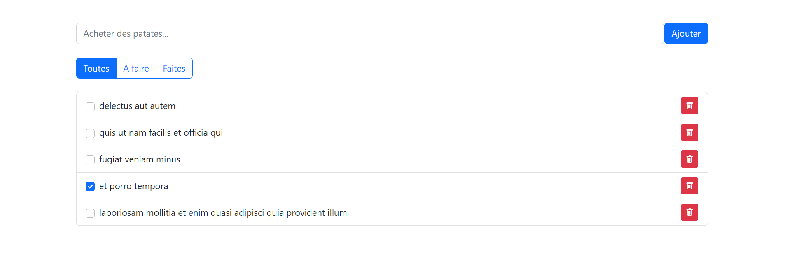

# 📝 My Todo List JS

Une application de gestion de tâches interactive, fluide et responsive réalisée en JavaScript pur (Vanilla JS) et un peu de bootstrap pour le style 😁

## 🚀 Fonctionnalités
- **Ajout rapide** : Créez des tâches en un clic ou avec la touche Entrée.
- **Suppression dynamique** : Nettoyez votre liste facilement (gestion via délégation d'événements).
- **Check-list** : Marquez vos tâches comme terminées.
- **Interface intuitive** : Un design épuré pour rester concentré sur l'essentiel.

## 🛠️ Technologies utilisées
- **HTML5** : Structure sémantique.
- **CSS3** : Framework Bootstrap.
- **JavaScript (ES6+)** : Programmation orientée objet, manipulation du DOM et gestion des événements.

## 📸 Aperçu
> 

## ⚙️ Installation
Si vous souhaitez tester le projet localement :
1. Clonez le dépôt :
   ```bash
   git clone https://github.com
